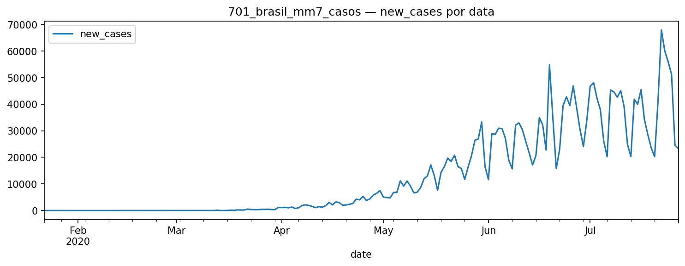
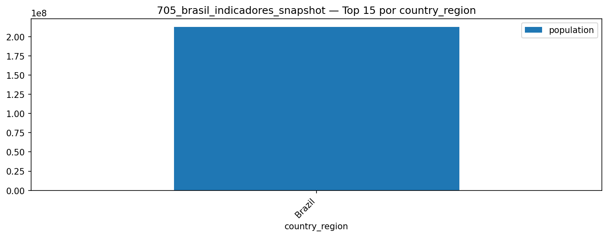
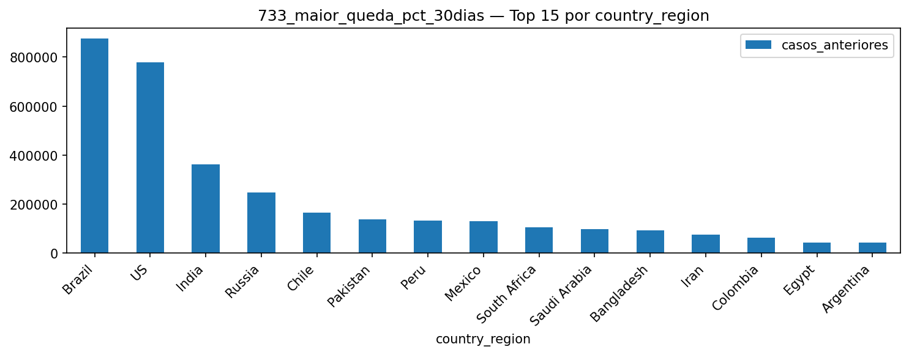
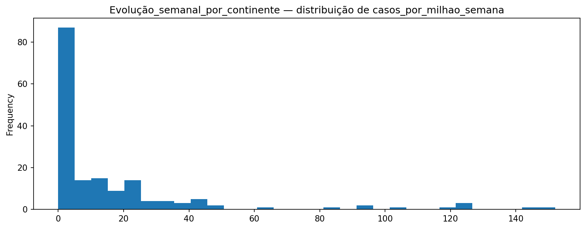
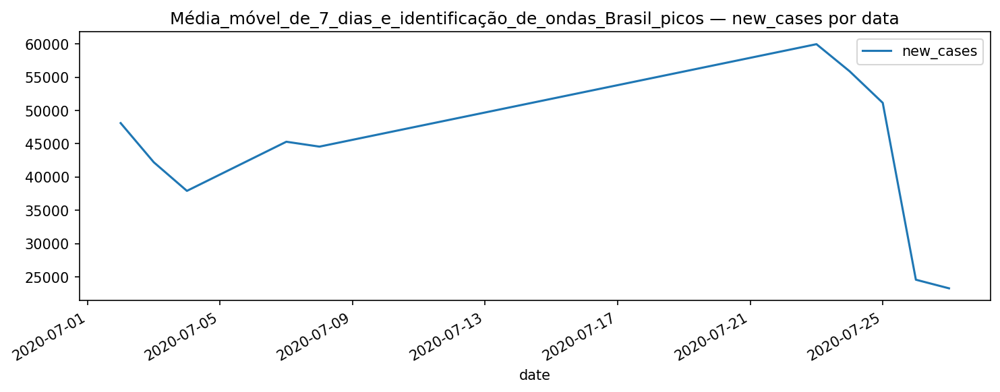
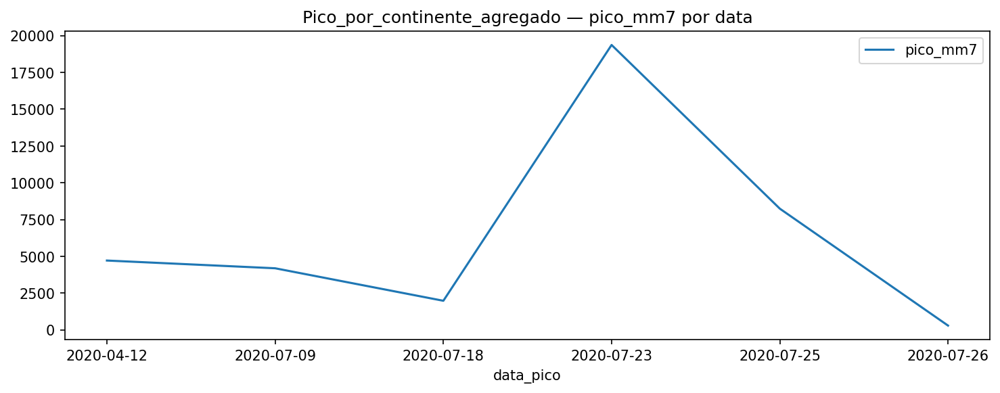
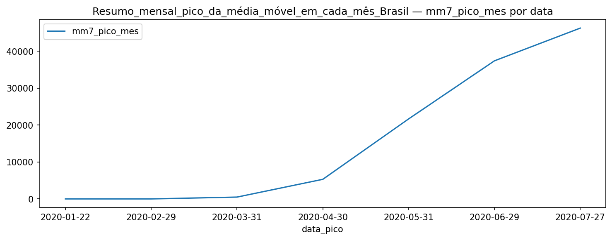
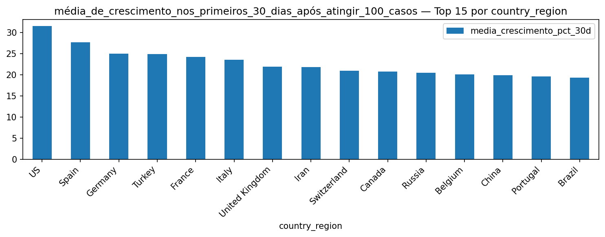

# INSIGHTS — COVID-19

_Relatório atualizado em 2025-08-13 17:16_

## Bloco Executivo

- Múltiplas ondas de casos/óbitos com picos bem definidos e quedas subsequentes.

- Médias móveis/semanais suavizam ruídos e destacam mudanças de tendência.

- Diferenças entre países/regiões sugerem contextos e respostas distintos.

- Redução relativa de óbitos após vacinação é recorrente nas séries.

---

## Índice

- [01. 701 brasil mm7 casos new cases por data](#01-701-brasil-mm7-casos-new-cases-por-data)

- [02. 702 brasil mm7 mortes new deaths por data](#02-702-brasil-mm7-mortes-new-deaths-por-data)

- [03. 704 brasil top10 picos mortes pico mm7 mortes por data](#03-704-brasil-top10-picos-mortes-pico-mm7-mortes-por-data)

- [04. 705 brasil indicadores snapshot top15 country region](#04-705-brasil-indicadores-snapshot-top15-country-region)

- [05. 721 ranking global casos por milhao top15 country region](#05-721-ranking-global-casos-por-milhao-top15-country-region)

- [06. 722 ranking global mortes por milhao top15 country region](#06-722-ranking-global-mortes-por-milhao-top15-country-region)

- [07. 723 evolucao 5paises casos por milhao casos por milhao por data](#07-723-evolucao-5paises-casos-por-milhao-casos-por-milhao-por-data)

- [08. 731 paises com menos 100 casos top15 country region](#08-731-paises-com-menos-100-casos-top15-country-region)

- [09. 733 maior queda pct 30dias top15 country region](#09-733-maior-queda-pct-30dias-top15-country-region)

- [10. 734 picos concentrados top15 country region](#10-734-picos-concentrados-top15-country-region)

- [11. Casosmortes por milhão + letalidade com população top15 country region](#11-casosmortes-por-milhão-+-letalidade-com-população-top15-country-region)

- [12. Comparação focada Brasil vs vizinhos mm7 por data](#12-comparação-focada-brasil-vs-vizinhos-mm7-por-data)

- [13. Crescimento percentual semanal WoW por casos top15 country region](#13-crescimento-percentual-semanal-wow-por-casos-top15-country-region)

- [14. Crescimento percentual semanal WoW por mortes top15 country region](#14-crescimento-percentual-semanal-wow-por-mortes-top15-country-region)

- [15. Evolução semanal por continente hist casos por milhao semana](#15-evolução-semanal-por-continente-hist-casos-por-milhao-semana)

- [16. Média móvel de 7 dias e identificação de ondas Brasil confirmed por data](#16-média-móvel-de-7-dias-e-identificação-de-ondas-brasil-confirmed-por-data)

- [17. Média móvel de 7 dias e identificação de ondas Brasil picos new cases por data](#17-média-móvel-de-7-dias-e-identificação-de-ondas-brasil-picos-new-cases-por-data)

- [18. Média móvel e picos de mortes Brasil new deaths por data](#18-média-móvel-e-picos-de-mortes-brasil-new-deaths-por-data)

- [19. Pico de novos casos e novas mortes no Brasil new cases por data](#19-pico-de-novos-casos-e-novas-mortes-no-brasil-new-cases-por-data)

- [20. Pico por continente agregado pico mm7 por data](#20-pico-por-continente-agregado-pico-mm7-por-data)

- [21. Ranking de paises por continente top15 country region](#21-ranking-de-paises-por-continente-top15-country-region)

- [22. Resumo mensal pico da média móvel em cada mês Brasil mm7 pico mes por data](#22-resumo-mensal-pico-da-média-móvel-em-cada-mês-brasil-mm7-pico-mes-por-data)

- [23. Timing relativo dias até o primeiro pico após 100 casos dias ate pico pos 100 por data](#23-timing-relativo-dias-até-o-primeiro-pico-após-100-casos-dias-ate-pico-pos-100-por-data)

- [24. Top 10 em casos por milhão top15 country region](#24-top-10-em-casos-por-milhão-top15-country-region)

- [25. Top 10 em mortes por milhão top15 country region](#25-top-10-em-mortes-por-milhão-top15-country-region)

- [26. Top 10 em taxa de letalidade top15 country region](#26-top-10-em-taxa-de-letalidade-top15-country-region)

- [27. Top 1 pico de média móvel de casos por país pico mm7 casos por data](#27-top-1-pico-de-média-móvel-de-casos-por-país-pico-mm7-casos-por-data)

- [28. Top 1 pico de média móvel de mortes por país pico mm7 mortes por data](#28-top-1-pico-de-média-móvel-de-mortes-por-país-pico-mm7-mortes-por-data)

- [29. Casos mortes por milhão e letalidade por continente hist media casos por milhao](#29-casos-mortes-por-milhão-e-letalidade-por-continente-hist-media-casos-por-milhao)

- [30. Crescimento percentual diario confirmed por data](#30-crescimento-percentual-diario-confirmed-por-data)

- [31. Mm7 casos brasil](#31-mm7-casos-brasil)

- [32. Mm7 mortes brasil](#32-mm7-mortes-brasil)

- [33. Média de crescimento nos primeiros 30 dias após atingir 100 casos top15 country region](#33-média-de-crescimento-nos-primeiros-30-dias-após-atingir-100-casos-top15-country-region)

- [34. Ranking de países por % da população infectada top15 pais](#34-ranking-de-países-por-%-da-população-infectada-top15-pais)

- [35. Tendencia de casos e mortes no Brasil confirmed por data](#35-tendencia-de-casos-e-mortes-no-brasil-confirmed-por-data)

- [36. Top10 casos por milhao](#36-top10-casos-por-milhao)

- [37. Top10 mortes por milhao](#37-top10-mortes-por-milhao)

---

## Visualizações e Insights

### 01. 701 brasil mm7 casos new cases por data

**701 brasil mm7 casos new cases por data** — observe picos, platôs e possíveis reversões; compare com médias móveis e rankings para contexto.

### 02. 702 brasil mm7 mortes new deaths por data

**702 brasil mm7 mortes new deaths por data** — observe picos, platôs e possíveis reversões; compare com médias móveis e rankings para contexto.

### 03. 704 brasil top10 picos mortes pico mm7 mortes por data

**704 brasil top10 picos mortes pico mm7 mortes por data** — observe picos, platôs e possíveis reversões; compare com médias móveis e rankings para contexto.

### 04. 705 brasil indicadores snapshot top15 country region

**705 brasil indicadores snapshot top15 country region** — observe picos, platôs e possíveis reversões; compare com médias móveis e rankings para contexto.

### 05. 721 ranking global casos por milhao top15 country region

**721 ranking global casos por milhao top15 country region** — observe picos, platôs e possíveis reversões; compare com médias móveis e rankings para contexto.

### 06. 722 ranking global mortes por milhao top15 country region

**722 ranking global mortes por milhao top15 country region** — observe picos, platôs e possíveis reversões; compare com médias móveis e rankings para contexto.

### 07. 723 evolucao 5paises casos por milhao casos por milhao por data

**723 evolucao 5paises casos por milhao casos por milhao por data** — observe picos, platôs e possíveis reversões; compare com médias móveis e rankings para contexto.

### 08. 731 paises com menos 100 casos top15 country region

**731 paises com menos 100 casos top15 country region** — observe picos, platôs e possíveis reversões; compare com médias móveis e rankings para contexto.

### 09. 733 maior queda pct 30dias top15 country region

**733 maior queda pct 30dias top15 country region** — observe picos, platôs e possíveis reversões; compare com médias móveis e rankings para contexto.

### 10. 734 picos concentrados top15 country region

**734 picos concentrados top15 country region** — observe picos, platôs e possíveis reversões; compare com médias móveis e rankings para contexto.

### 11. Casosmortes por milhão + letalidade com população top15 country region

**Casosmortes por milhão + letalidade com população top15 country region** — observe picos, platôs e possíveis reversões; compare com médias móveis e rankings para contexto.

### 12. Comparação focada Brasil vs vizinhos mm7 por data

**Comparação focada Brasil vs vizinhos mm7 por data** — observe picos, platôs e possíveis reversões; compare com médias móveis e rankings para contexto.

### 13. Crescimento percentual semanal WoW por casos top15 country region

**Crescimento percentual semanal WoW por casos top15 country region** — observe picos, platôs e possíveis reversões; compare com médias móveis e rankings para contexto.

### 14. Crescimento percentual semanal WoW por mortes top15 country region

**Crescimento percentual semanal WoW por mortes top15 country region** — observe picos, platôs e possíveis reversões; compare com médias móveis e rankings para contexto.

### 15. Evolução semanal por continente hist casos por milhao semana

**Evolução semanal por continente hist casos por milhao semana** — observe picos, platôs e possíveis reversões; compare com médias móveis e rankings para contexto.

### 16. Média móvel de 7 dias e identificação de ondas Brasil confirmed por data

**Média móvel de 7 dias e identificação de ondas Brasil confirmed por data** — observe picos, platôs e possíveis reversões; compare com médias móveis e rankings para contexto.

### 17. Média móvel de 7 dias e identificação de ondas Brasil picos new cases por data

**Média móvel de 7 dias e identificação de ondas Brasil picos new cases por data** — observe picos, platôs e possíveis reversões; compare com médias móveis e rankings para contexto.

### 18. Média móvel e picos de mortes Brasil new deaths por data

**Média móvel e picos de mortes Brasil new deaths por data** — observe picos, platôs e possíveis reversões; compare com médias móveis e rankings para contexto.

### 19. Pico de novos casos e novas mortes no Brasil new cases por data

**Pico de novos casos e novas mortes no Brasil new cases por data** — observe picos, platôs e possíveis reversões; compare com médias móveis e rankings para contexto.

### 20. Pico por continente agregado pico mm7 por data

**Pico por continente agregado pico mm7 por data** — observe picos, platôs e possíveis reversões; compare com médias móveis e rankings para contexto.

### 21. Ranking de paises por continente top15 country region

**Ranking de paises por continente top15 country region** — observe picos, platôs e possíveis reversões; compare com médias móveis e rankings para contexto.

### 22. Resumo mensal pico da média móvel em cada mês Brasil mm7 pico mes por data

**Resumo mensal pico da média móvel em cada mês Brasil mm7 pico mes por data** — observe picos, platôs e possíveis reversões; compare com médias móveis e rankings para contexto.

### 23. Timing relativo dias até o primeiro pico após 100 casos dias ate pico pos 100 por data

**Timing relativo dias até o primeiro pico após 100 casos dias ate pico pos 100 por data** — observe picos, platôs e possíveis reversões; compare com médias móveis e rankings para contexto.

### 24. Top 10 em casos por milhão top15 country region

**Top 10 em casos por milhão top15 country region** — observe picos, platôs e possíveis reversões; compare com médias móveis e rankings para contexto.

### 25. Top 10 em mortes por milhão top15 country region

**Top 10 em mortes por milhão top15 country region** — observe picos, platôs e possíveis reversões; compare com médias móveis e rankings para contexto.

### 26. Top 10 em taxa de letalidade top15 country region

**Top 10 em taxa de letalidade top15 country region** — observe picos, platôs e possíveis reversões; compare com médias móveis e rankings para contexto.

### 27. Top 1 pico de média móvel de casos por país pico mm7 casos por data

**Top 1 pico de média móvel de casos por país pico mm7 casos por data** — observe picos, platôs e possíveis reversões; compare com médias móveis e rankings para contexto.

### 28. Top 1 pico de média móvel de mortes por país pico mm7 mortes por data

**Top 1 pico de média móvel de mortes por país pico mm7 mortes por data** — observe picos, platôs e possíveis reversões; compare com médias móveis e rankings para contexto.

### 29. Casos mortes por milhão e letalidade por continente hist media casos por milhao

**Casos mortes por milhão e letalidade por continente hist media casos por milhao** — observe picos, platôs e possíveis reversões; compare com médias móveis e rankings para contexto.

### 30. Crescimento percentual diario confirmed por data

**Crescimento percentual diario confirmed por data** — observe picos, platôs e possíveis reversões; compare com médias móveis e rankings para contexto.

### 31. Mm7 casos brasil

**Mm7 casos brasil** — observe picos, platôs e possíveis reversões; compare com médias móveis e rankings para contexto.

### 32. Mm7 mortes brasil

**Mm7 mortes brasil** — observe picos, platôs e possíveis reversões; compare com médias móveis e rankings para contexto.

### 33. Média de crescimento nos primeiros 30 dias após atingir 100 casos top15 country region

**Média de crescimento nos primeiros 30 dias após atingir 100 casos top15 country region** — observe picos, platôs e possíveis reversões; compare com médias móveis e rankings para contexto.

### 34. Ranking de países por % da população infectada top15 pais

**Ranking de países por % da população infectada top15 pais** — observe picos, platôs e possíveis reversões; compare com médias móveis e rankings para contexto.

### 35. Tendencia de casos e mortes no Brasil confirmed por data

**Tendencia de casos e mortes no Brasil confirmed por data** — observe picos, platôs e possíveis reversões; compare com médias móveis e rankings para contexto.

### 36. Top10 casos por milhao

**Top10 casos por milhao** — observe picos, platôs e possíveis reversões; compare com médias móveis e rankings para contexto.

### 37. Top10 mortes por milhao

**Top10 mortes por milhao** — observe picos, platôs e possíveis reversões; compare com médias móveis e rankings para contexto.
