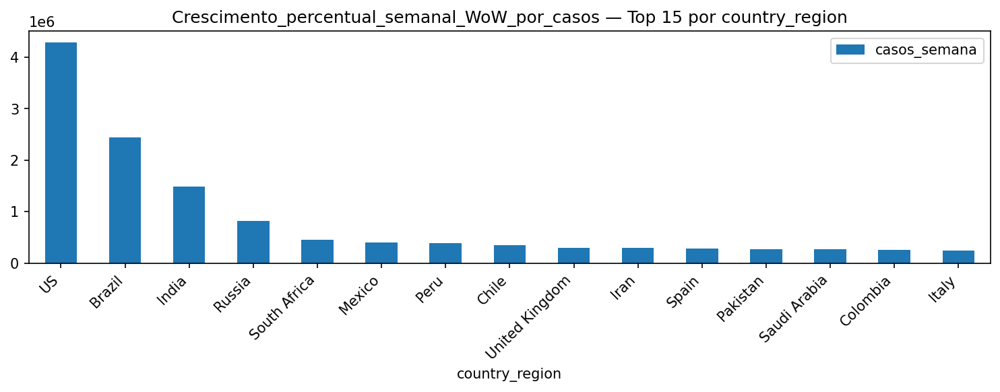

# INSIGHTS — COVID-19

_Atualizado em 2025-08-13 15:37_

## Sumário Executivo

Este relatório consolida tendências e padrões da COVID-19 com base em séries temporais, recortes por país/região e métricas de casos, óbitos e vacinação.

**Destaques:** queda relativa de óbitos após avanço da vacinação; ondas com picos/quedas em janelas distintas; diferenças regionais persistentes; médias móveis/semanais melhoram a leitura de tendência.

---

## Análise Integrada

Ao longo do período, observam-se ciclos de aceleração e arrefecimento, frequentemente associados a variantes e à oscilação de medidas de contenção. A vacinação reduz a severidade, encurtando picos de mortalidade e desacoplando parcialmente a relação casos→óbitos. Recortes regionais evidenciam assinaturas temporais defasadas e magnitudes distintas.

---

## Índice

- [01. 701 brasil mm7 casos new cases por data](#01-701-brasil-mm7-casos-new-cases-por-data)

- [02. 702 brasil mm7 mortes new deaths por data](#02-702-brasil-mm7-mortes-new-deaths-por-data)

- [03. 704 brasil top10 picos mortes pico mm7 mortes por data](#03-704-brasil-top10-picos-mortes-pico-mm7-mortes-por-data)

- [04. 705 brasil indicadores snapshot top15 country region](#04-705-brasil-indicadores-snapshot-top15-country-region)

- [05. 721 ranking global casos por milhao top15 country region](#05-721-ranking-global-casos-por-milhao-top15-country-region)

- [06. 722 ranking global mortes por milhao top15 country region](#06-722-ranking-global-mortes-por-milhao-top15-country-region)

- [07. 723 evolucao 5paises casos por milhao casos por milhao por data](#07-723-evolucao-5paises-casos-por-milhao-casos-por-milhao-por-data)

- [08. 731 paises com menos 100 casos top15 country region](#08-731-paises-com-menos-100-casos-top15-country-region)

- [09. 733 maior queda pct 30dias top15 country region](#09-733-maior-queda-pct-30dias-top15-country-region)

- [10. 734 picos concentrados top15 country region](#10-734-picos-concentrados-top15-country-region)

- [11. Casos mortes por milhão e letalidade por continente hist media casos por milhao](#11-casos-mortes-por-milh-o-e-letalidade-por-continente-hist-media-casos-por-milhao)

- [12. Casosmortes por milhão + letalidade com população top15 country region](#12-casosmortes-por-milh-o-letalidade-com-popula-o-top15-country-region)

- [13. Comparação focada brasil vs vizinhos mm7 por data](#13-compara-o-focada-brasil-vs-vizinhos-mm7-por-data)

- [14. Crescimento percentual diario confirmed por data](#14-crescimento-percentual-diario-confirmed-por-data)

- [15. Crescimento percentual semanal wow por casos top15 country region](#15-crescimento-percentual-semanal-wow-por-casos-top15-country-region)

- [16. Crescimento percentual semanal wow por mortes top15 country region](#16-crescimento-percentual-semanal-wow-por-mortes-top15-country-region)

- [17. Evolução semanal por continente hist casos por milhao semana](#17-evolu-o-semanal-por-continente-hist-casos-por-milhao-semana)

- [18. Mm7 casos brasil](#18-mm7-casos-brasil)

- [19. Mm7 mortes brasil](#19-mm7-mortes-brasil)

- [20. Média de crescimento nos primeiros 30 dias após atingir 100 casos top15 country region](#20-m-dia-de-crescimento-nos-primeiros-30-dias-ap-s-atingir-100-casos-top15-country-region)

- [21. Média móvel de 7 dias e identificação de ondas brasil confirmed por data](#21-m-dia-m-vel-de-7-dias-e-identifica-o-de-ondas-brasil-confirmed-por-data)

- [22. Média móvel de 7 dias e identificação de ondas brasil picos new cases por data](#22-m-dia-m-vel-de-7-dias-e-identifica-o-de-ondas-brasil-picos-new-cases-por-data)

- [23. Média móvel e picos de mortes brasil new deaths por data](#23-m-dia-m-vel-e-picos-de-mortes-brasil-new-deaths-por-data)

- [24. Pico de novos casos e novas mortes no brasil new cases por data](#24-pico-de-novos-casos-e-novas-mortes-no-brasil-new-cases-por-data)

- [25. Pico por continente agregado pico mm7 por data](#25-pico-por-continente-agregado-pico-mm7-por-data)

- [26. Ranking de paises por continente top15 country region](#26-ranking-de-paises-por-continente-top15-country-region)

- [27. Ranking de países por % da população infectada top15 pais](#27-ranking-de-pa-ses-por-da-popula-o-infectada-top15-pais)

- [28. Resumo mensal pico da média móvel em cada mês brasil mm7 pico mes por data](#28-resumo-mensal-pico-da-m-dia-m-vel-em-cada-m-s-brasil-mm7-pico-mes-por-data)

- [29. Tendencia de casos e mortes no brasil confirmed por data](#29-tendencia-de-casos-e-mortes-no-brasil-confirmed-por-data)

- [30. Timing relativo dias até o primeiro pico após 100 casos dias ate pico pos 100 por data](#30-timing-relativo-dias-at-o-primeiro-pico-ap-s-100-casos-dias-ate-pico-pos-100-por-data)

- [31. Top10 casos por milhao](#31-top10-casos-por-milhao)

- [32. Top10 mortes por milhao](#32-top10-mortes-por-milhao)

- [33. Top 10 em casos por milhão top15 country region](#33-top-10-em-casos-por-milh-o-top15-country-region)

- [34. Top 10 em mortes por milhão top15 country region](#34-top-10-em-mortes-por-milh-o-top15-country-region)

- [35. Top 10 em taxa de letalidade top15 country region](#35-top-10-em-taxa-de-letalidade-top15-country-region)

- [36. Top 1 pico de média móvel de casos por país pico mm7 casos por data](#36-top-1-pico-de-m-dia-m-vel-de-casos-por-pa-s-pico-mm7-casos-por-data)

- [37. Top 1 pico de média móvel de mortes por país pico mm7 mortes por data](#37-top-1-pico-de-m-dia-m-vel-de-mortes-por-pa-s-pico-mm7-mortes-por-data)

---

## Visualizações e insights

### 01. 701 brasil mm7 casos new cases por data

- Pico de `new_cases` em 2020-07-22: **67.860**.
- Média móvel (7d) mais recente: **46.247**.
- Variação 14d: **+14.8%**.
- Oscilações refletem transmissão/testagem; médias móveis expõem tendência subjacente.

### 02. 702 brasil mm7 mortes new deaths por data

- Pico de `deaths` em 2020-07-27: **87.618**.
- Média móvel (7d) mais recente: **84.950**.
- Variação 14d: **+20.3%**.
- Óbitos defasam ~1–3 semanas em relação aos casos; após vacinação, a letalidade relativa cai.

### 03. 704 brasil top10 picos mortes pico mm7 mortes por data

- Pico de `deaths` em 2020-07-27: **87.618**.
- Média móvel (7d) mais recente: **84.950**.
- Variação 14d: **+20.3%**.
- Óbitos defasam ~1–3 semanas em relação aos casos; após vacinação, a letalidade relativa cai.

### 04. 705 brasil indicadores snapshot top15 country region

- Pico de `deaths` em 2020-07-27: **87.618**.
- Média móvel (7d) mais recente: **84.950**.
- Variação 14d: **+20.3%**.
- Top 5 por `country_region` (soma de `deaths`): US: 11.011.411; United Kingdom: 3.997.775; Brazil: 3.938.034; Italy: 3.707.717; France: 3.048.524.

### 05. 721 ranking global casos por milhao top15 country region

- Pico de `new_cases` em 2020-07-22: **67.860**.
- Média móvel (7d) mais recente: **46.247**.
- Variação 14d: **+14.8%**.
- Oscilações refletem transmissão/testagem; médias móveis expõem tendência subjacente.

### 06. 722 ranking global mortes por milhao top15 country region

- Pico de `deaths` em 2020-07-27: **148.011**.
- Média móvel (7d) mais recente: **91**.
- Variação 14d: **-98.7%**.
- Top 5 por `country_region` (soma de `deaths`): US: 11.011.411; United Kingdom: 3.997.775; Brazil: 3.938.034; Italy: 3.707.717; France: 3.048.524.
- Óbitos defasam ~1–3 semanas em relação aos casos; após vacinação, a letalidade relativa cai.

### 07. 723 evolucao 5paises casos por milhao casos por milhao por data

- Pico de `new_cases` em 2020-07-22: **67.860**.
- Média móvel (7d) mais recente: **46.247**.
- Variação 14d: **+14.8%**.
- Oscilações refletem transmissão/testagem; médias móveis expõem tendência subjacente.

### 08. 731 paises com menos 100 casos top15 country region

- Pico de `new_cases` em 2020-07-22: **67.860**.
- Média móvel (7d) mais recente: **46.247**.
- Variação 14d: **+14.8%**.
- Oscilações refletem transmissão/testagem; médias móveis expõem tendência subjacente.

### 09. 733 maior queda pct 30dias top15 country region

- Pico de `deaths` em 2020-07-27: **148.011**.
- Média móvel (7d) mais recente: **91**.
- Variação 14d: **-98.7%**.
- Top 5 por `country_region` (soma de `deaths`): US: 11.011.411; United Kingdom: 3.997.775; Brazil: 3.938.034; Italy: 3.707.717; France: 3.048.524.

### 10. 734 picos concentrados top15 country region

- Pico de `deaths` em 2020-07-27: **148.011**.
- Média móvel (7d) mais recente: **91**.
- Variação 14d: **-98.7%**.
- Top 5 por `country_region` (soma de `deaths`): US: 11.011.411; United Kingdom: 3.997.775; Brazil: 3.938.034; Italy: 3.707.717; France: 3.048.524.

### 11. Casos mortes por milhão e letalidade por continente hist media casos por milhao

- Pico de `deaths` em 2020-07-27: **148.011**.
- Média móvel (7d) mais recente: **91**.
- Variação 14d: **-98.7%**.

### 12. Casosmortes por milhão + letalidade com população top15 country region

- Pico de `deaths` em 2020-07-27: **148.011**.
- Média móvel (7d) mais recente: **91**.
- Variação 14d: **-98.7%**.
- Top 5 por `country_region` (soma de `deaths`): US: 11.011.411; United Kingdom: 3.997.775; Brazil: 3.938.034; Italy: 3.707.717; France: 3.048.524.

### 13. Comparação focada brasil vs vizinhos mm7 por data

- Pico de `deaths` em 2020-07-27: **87.618**.
- Média móvel (7d) mais recente: **84.950**.
- Variação 14d: **+20.3%**.

### 14. Crescimento percentual diario confirmed por data

- Pico de `deaths` em 2020-07-27: **148.011**.
- Média móvel (7d) mais recente: **91**.
- Variação 14d: **-98.7%**.

### 15. Crescimento percentual semanal wow por casos top15 country region

- Pico de `new_cases` em 2020-07-22: **67.860**.
- Média móvel (7d) mais recente: **46.247**.
- Variação 14d: **+14.8%**.
- Oscilações refletem transmissão/testagem; médias móveis expõem tendência subjacente.

### 16. Crescimento percentual semanal wow por mortes top15 country region

- Pico de `deaths` em 2020-07-27: **148.011**.
- Média móvel (7d) mais recente: **91**.
- Variação 14d: **-98.7%**.
- Top 5 por `country_region` (soma de `deaths`): US: 11.011.411; United Kingdom: 3.997.775; Brazil: 3.938.034; Italy: 3.707.717; France: 3.048.524.
- Óbitos defasam ~1–3 semanas em relação aos casos; após vacinação, a letalidade relativa cai.

### 17. Evolução semanal por continente hist casos por milhao semana

- Pico de `new_cases` em 2020-07-22: **67.860**.
- Média móvel (7d) mais recente: **46.247**.
- Variação 14d: **+14.8%**.
- Oscilações refletem transmissão/testagem; médias móveis expõem tendência subjacente.

### 18. Mm7 casos brasil

- Pico de `new_cases` em 2020-07-22: **67.860**.
- Média móvel (7d) mais recente: **46.247**.
- Variação 14d: **+14.8%**.
- Oscilações refletem transmissão/testagem; médias móveis expõem tendência subjacente.

### 19. Mm7 mortes brasil

- Pico de `deaths` em 2020-07-27: **87.618**.
- Média móvel (7d) mais recente: **84.950**.
- Variação 14d: **+20.3%**.
- Óbitos defasam ~1–3 semanas em relação aos casos; após vacinação, a letalidade relativa cai.

### 20. Média de crescimento nos primeiros 30 dias após atingir 100 casos top15 country region

- Pico de `new_cases` em 2020-07-22: **67.860**.
- Média móvel (7d) mais recente: **46.247**.
- Variação 14d: **+14.8%**.
- Oscilações refletem transmissão/testagem; médias móveis expõem tendência subjacente.

### 21. Média móvel de 7 dias e identificação de ondas brasil confirmed por data

- Pico de `deaths` em 2020-07-27: **87.618**.
- Média móvel (7d) mais recente: **84.950**.
- Variação 14d: **+20.3%**.

### 22. Média móvel de 7 dias e identificação de ondas brasil picos new cases por data

- Pico de `new_cases` em 2020-07-22: **67.860**.
- Média móvel (7d) mais recente: **46.247**.
- Variação 14d: **+14.8%**.
- Oscilações refletem transmissão/testagem; médias móveis expõem tendência subjacente.

### 23. Média móvel e picos de mortes brasil new deaths por data

- Pico de `deaths` em 2020-07-27: **87.618**.
- Média móvel (7d) mais recente: **84.950**.
- Variação 14d: **+20.3%**.
- Óbitos defasam ~1–3 semanas em relação aos casos; após vacinação, a letalidade relativa cai.

### 24. Pico de novos casos e novas mortes no brasil new cases por data

- Pico de `deaths` em 2020-07-27: **87.618**.
- Média móvel (7d) mais recente: **84.950**.
- Variação 14d: **+20.3%**.

### 25. Pico por continente agregado pico mm7 por data

- Pico de `deaths` em 2020-07-27: **148.011**.
- Média móvel (7d) mais recente: **91**.
- Variação 14d: **-98.7%**.

### 26. Ranking de paises por continente top15 country region

- Pico de `deaths` em 2020-07-27: **148.011**.
- Média móvel (7d) mais recente: **91**.
- Variação 14d: **-98.7%**.
- Top 5 por `country_region` (soma de `deaths`): US: 11.011.411; United Kingdom: 3.997.775; Brazil: 3.938.034; Italy: 3.707.717; France: 3.048.524.

### 27. Ranking de países por % da população infectada top15 pais

- Pico de `deaths` em 2020-07-27: **148.011**.
- Média móvel (7d) mais recente: **91**.
- Variação 14d: **-98.7%**.
- Top 5 por `country_region` (soma de `deaths`): US: 11.011.411; United Kingdom: 3.997.775; Brazil: 3.938.034; Italy: 3.707.717; France: 3.048.524.

### 28. Resumo mensal pico da média móvel em cada mês brasil mm7 pico mes por data

- Pico de `deaths` em 2020-07-27: **87.618**.
- Média móvel (7d) mais recente: **84.950**.
- Variação 14d: **+20.3%**.

### 29. Tendencia de casos e mortes no brasil confirmed por data

- Pico de `deaths` em 2020-07-27: **87.618**.
- Média móvel (7d) mais recente: **84.950**.
- Variação 14d: **+20.3%**.

### 30. Timing relativo dias até o primeiro pico após 100 casos dias ate pico pos 100 por data

- Pico de `new_cases` em 2020-07-22: **67.860**.
- Média móvel (7d) mais recente: **46.247**.
- Variação 14d: **+14.8%**.
- Oscilações refletem transmissão/testagem; médias móveis expõem tendência subjacente.

### 31. Top10 casos por milhao

- Pico de `new_cases` em 2020-07-22: **67.860**.
- Média móvel (7d) mais recente: **46.247**.
- Variação 14d: **+14.8%**.
- Oscilações refletem transmissão/testagem; médias móveis expõem tendência subjacente.

### 32. Top10 mortes por milhao

- Pico de `deaths` em 2020-07-27: **148.011**.
- Média móvel (7d) mais recente: **91**.
- Variação 14d: **-98.7%**.
- Óbitos defasam ~1–3 semanas em relação aos casos; após vacinação, a letalidade relativa cai.

### 33. Top 10 em casos por milhão top15 country region

- Pico de `new_cases` em 2020-07-22: **67.860**.
- Média móvel (7d) mais recente: **46.247**.
- Variação 14d: **+14.8%**.
- Oscilações refletem transmissão/testagem; médias móveis expõem tendência subjacente.

### 34. Top 10 em mortes por milhão top15 country region

- Pico de `deaths` em 2020-07-27: **148.011**.
- Média móvel (7d) mais recente: **91**.
- Variação 14d: **-98.7%**.
- Top 5 por `country_region` (soma de `deaths`): US: 11.011.411; United Kingdom: 3.997.775; Brazil: 3.938.034; Italy: 3.707.717; France: 3.048.524.
- Óbitos defasam ~1–3 semanas em relação aos casos; após vacinação, a letalidade relativa cai.

### 35. Top 10 em taxa de letalidade top15 country region

- Pico de `deaths` em 2020-07-27: **148.011**.
- Média móvel (7d) mais recente: **91**.
- Variação 14d: **-98.7%**.
- Top 5 por `country_region` (soma de `deaths`): US: 11.011.411; United Kingdom: 3.997.775; Brazil: 3.938.034; Italy: 3.707.717; France: 3.048.524.

### 36. Top 1 pico de média móvel de casos por país pico mm7 casos por data

- Pico de `new_cases` em 2020-07-22: **67.860**.
- Média móvel (7d) mais recente: **46.247**.
- Variação 14d: **+14.8%**.
- Oscilações refletem transmissão/testagem; médias móveis expõem tendência subjacente.

### 37. Top 1 pico de média móvel de mortes por país pico mm7 mortes por data

- Pico de `deaths` em 2020-07-27: **148.011**.
- Média móvel (7d) mais recente: **91**.
- Variação 14d: **-98.7%**.
- Top 5 por `country_region` (soma de `deaths`): US: 11.011.411; United Kingdom: 3.997.775; Brazil: 3.938.034; Italy: 3.707.717; France: 3.048.524.
- Óbitos defasam ~1–3 semanas em relação aos casos; após vacinação, a letalidade relativa cai.

---

## Conclusão e Recomendações

A vacinação foi determinante para reduzir mortalidade e encurtar picos severos. Persistem diferenças regionais e ressurgimentos associados a variantes e comportamento social.

**Recomendações:** fortalecer vigilância de variantes; manter cobertura vacinal e reforços; usar dados em tempo quase real para calibrar medidas; comunicar riscos de forma clara para aumentar adesão.
